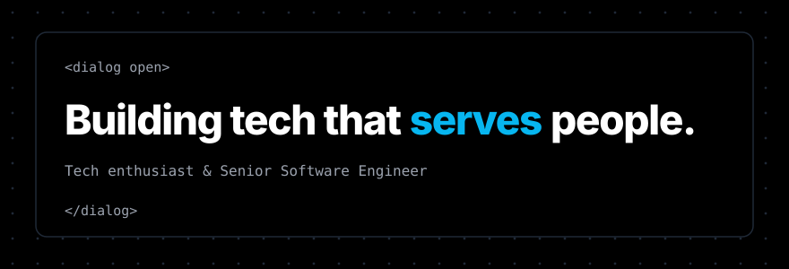

<picture>
  <source media="(prefers-color-scheme: dark)" srcset="assets/hero-dark.svg">
  <source media="(prefers-color-scheme: light)" srcset="assets/hero-light.svg">
  
</picture>

<a href="https://perfectui.dev"><picture><source media="(prefers-color-scheme: dark)" srcset="assets/btn-perfectui-dark.svg"><source media="(prefers-color-scheme: light)" srcset="assets/btn-perfectui-light.svg"></picture></a>
<a href="https://github.com/chrissgon/ai-workbench"><picture><source media="(prefers-color-scheme: dark)" srcset="assets/btn-ai-workbench-dark.svg"><source media="(prefers-color-scheme: light)" srcset="assets/btn-ai-workbench-light.svg"></picture></a>

I build tech that serves people, and I talk about how I build it. Today I'm a senior software engineer with 6+ years shipping production frontends, and I still get as excited as I did on day one.

This page isn't only about me. You can use it: pick what I write next, or tell me a problem worth solving.

## Now

- Rebuilding my site on [chrissgon.dev](https://chrissgon.dev) with Perfect UI, readable by people and by AI agents.
- Teaching an agent to answer comments on my posts, inside rules I approve.
- Turning this page into something you can use: pick my next post, or tell me a problem.

## Pick the next post

This week's slot is **Tech in conversation**. Pick the topic I write next: one pick per GitHub account, which you can change until the round closes on 2026-10-12.

<a href="https://github.com/chrissgon/chrissgon/issues/new?template=pick.yml&title=pick%3A%20A"><picture><source media="(prefers-color-scheme: dark)" srcset="assets/pick-a-dark.svg?v=e19f895e"><source media="(prefers-color-scheme: light)" srcset="assets/pick-a-light.svg?v=0a1822b6"></picture></a>
<a href="https://github.com/chrissgon/chrissgon/issues/new?template=pick.yml&title=pick%3A%20B"><picture><source media="(prefers-color-scheme: dark)" srcset="assets/pick-b-dark.svg?v=b9516910"><source media="(prefers-color-scheme: light)" srcset="assets/pick-b-light.svg?v=e68b19c9"></picture></a>
<a href="https://github.com/chrissgon/chrissgon/issues/new?template=pick.yml&title=pick%3A%20C"><picture><source media="(prefers-color-scheme: dark)" srcset="assets/pick-c-dark.svg?v=88d82bf3"><source media="(prefers-color-scheme: light)" srcset="assets/pick-c-light.svg?v=3dc50020"></picture></a>

Last round you picked **LinkedIn's API won't let me read comments. What I did instead.**. I'm writing it now.

## Tell me a problem

Something gets in your way and tech could fix it? [Tell me about it](https://github.com/chrissgon/chrissgon/issues/new?template=problem.yml). I read every problem that comes in and pick some to build in public.

No accepted problems yet. Yours could be the first.

## What I build

<details open>
<summary><b>Perfect UI</b>: a 3.7 kB UI library where the browser does the work</summary>

No runtime dependencies. Behavior comes from the browser (`<details>`, `<dialog>`, `popover`), so pages stay light even on a slow connection.

```bash
npm i @chrissgon/perfectui
```

[perfectui.dev](https://perfectui.dev)
</details>

<details open>
<summary><b>ai-workbench</b>: skills, agents and workflows that let an AI build software end to end</summary>

Tested on strong and cheap models. [github.com/chrissgon/ai-workbench](https://github.com/chrissgon/ai-workbench)
</details>

<picture>
  <source media="(prefers-color-scheme: dark)" srcset="assets/numbers-dark.svg?v=7b5b7194">
  <source media="(prefers-color-scheme: light)" srcset="assets/numbers-light.svg?v=1b9792d5">
  
</picture>

## What I write about

- **Build to serve:** who each project is for, and the minimal web as a way to serve. Got a problem worth solving? [Tell me](#tell-me-a-problem).
- **AI built in public:** ai-workbench from the inside, with what worked, what failed and real numbers. [The numbers](#what-i-build) are measured every Monday.
- **Tech in conversation:** what I learn from people and events, and tech news with an opinion. [Pick the next topic](#pick-the-next-post).

## Latest posts

<a href="https://www.linkedin.com/feed/update/urn:li:share:7510677308874231808/"><picture><source media="(prefers-color-scheme: dark)" srcset="assets/post-2026-09-29-dark.svg?v=5820761b"><source media="(prefers-color-scheme: light)" srcset="assets/post-2026-09-29-light.svg?v=2b2c0b3a"></picture></a>

[chrissgon.dev](https://chrissgon.dev) · [LinkedIn](https://www.linkedin.com/in/chrissgon/) · [npm @chrissgon](https://www.npmjs.com/package/@chrissgon/perfectui) · [chrissgon.dev@gmail.com](mailto:chrissgon.dev@gmail.com)

<sub>This page only uses what GitHub already gives, `<picture>`, `<details>`, issues and Actions, and loads 0 files from third-party services. Picks and problems are handled by [scripts/readme.py](scripts/readme.py); the README is rebuilt from [its template](scripts/README.template.md).</sub>

Teaching with what I learn, learning from what I teach. What's the smallest thing you've built that made someone's day easier?
